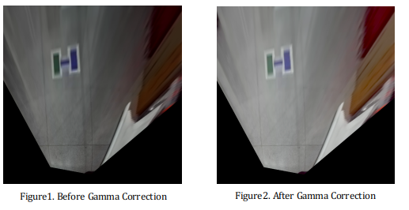
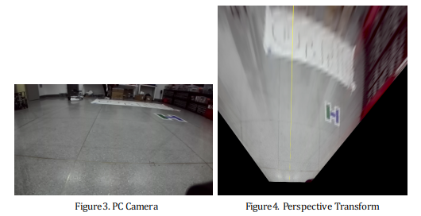
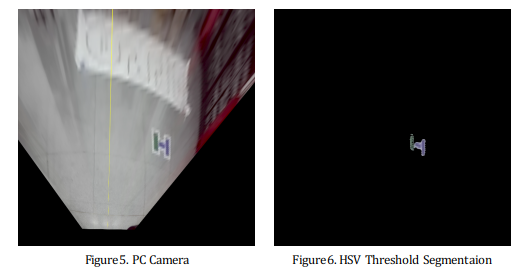
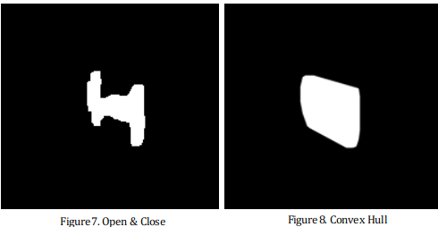
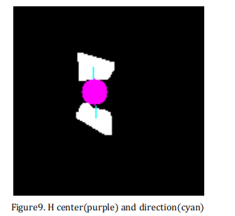
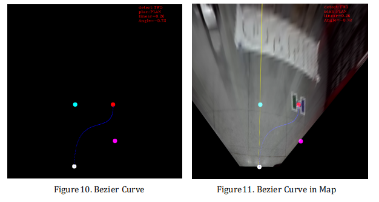

# DIP Final Project

Author: Siqi Liang

## Digital-Image-Processing

A course taught by Prof. Haoyao Chen & Xiaojun Wu in the fall of 2021. It contains four experiments and a final project.

*we love to call this course DIP :)*

## Final Project

~~We~~ I chose to do the Autonomous Parking Experiment. 

Here are some results.

<video src="README.assets/演示-手机视角.mp4"></video>

## Requirement

- OpenCV3
- Eigen3
- ROS Melodic

## Install

~~~sh
mkdir -p dip_ws/src
cd dip_ws/src
git clone https://github.com/stdcat/DIP_Final_Project.git
cd ..
catkin_make
~~~

then just run 

~~~sh
rosrun dip_final dip_final
~~~

 

